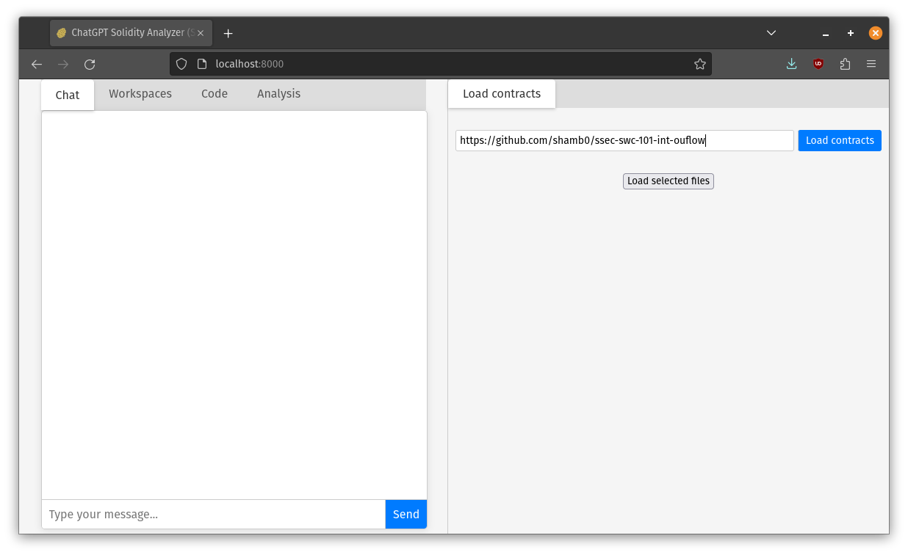
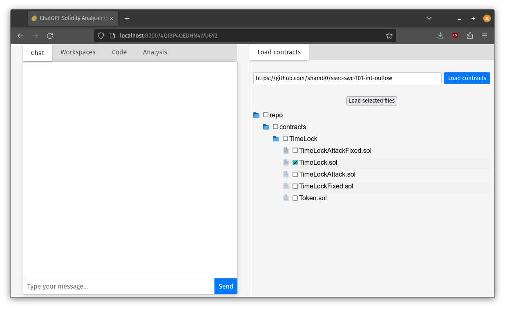
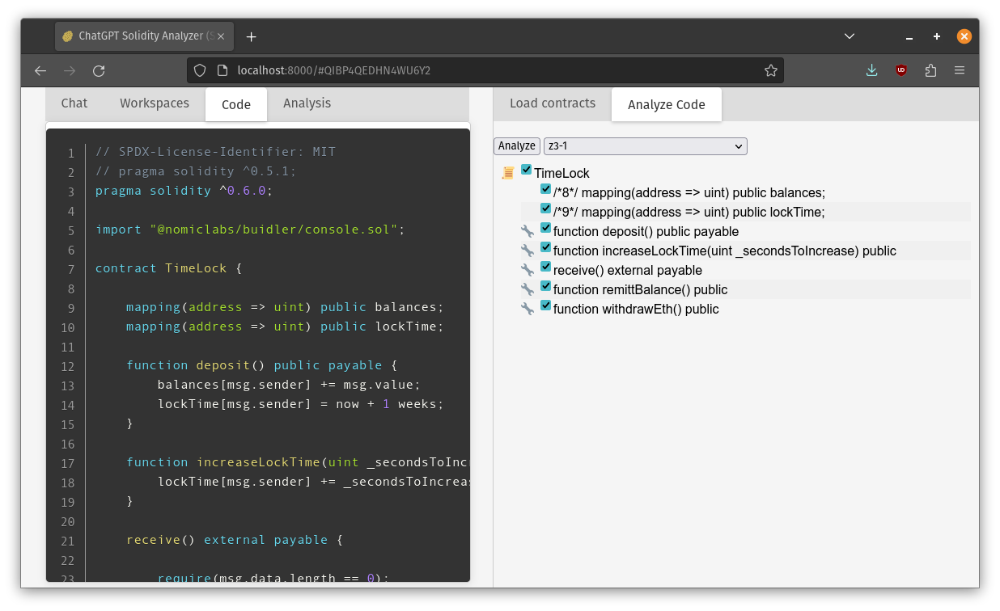
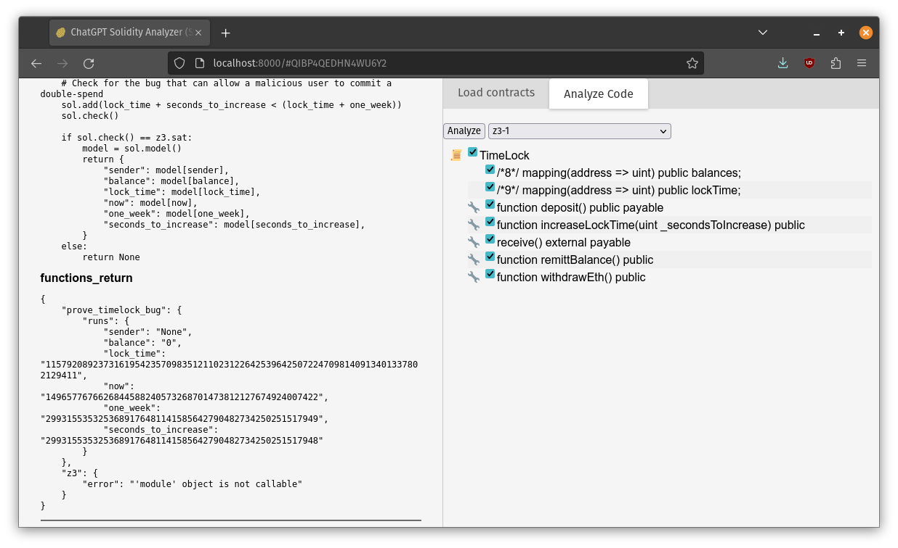

# Polymer (aka Turbo Potato / SkyNet)

Is powered by insomnia & laziness, a lot of the code was written by ChatGPT.

## Example Usage

In this example we use the Z3 analyzer to find inputs to exploit a contract. This is from an integer overflow example contract at: https://github.com/shamb0/ssec-swc-101-int-ouflow

#### Load contracts from the repository


#### Select which files to analyze


#### Uncheck code which statements you want to include or exclude, and the analyzer prompt


#### See that it generates an exploit and runs it to get results


## Building & Running

This project needs to run things inside Docker, so the top-level project may not be easy to run Docker inside a Docker.

To install requirements then run the API do:

```shell
$ apt-get install make python3-pip
$ make python-requirements docker-build
$ make api
```

## Resources

 * https://swcregistry.io/
 * https://www.dasp.co/
 * https://consensys.github.io/smart-contract-best-practices/

## Repos for testing

 * https://github.com/shamb0/ssec-swc-101-int-ouflow
